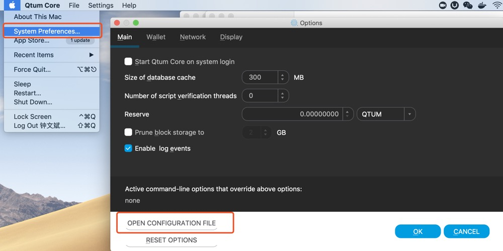

# How to add options for Evo node（or add config file）

User can specify extra options (or set configurations) for Evo node, in order to enable/disable some specific features, other than default settings.

This tutorial describes how to specify options (or configurations) to Evo node.

## For Evo PC wallet（Evo Core qt wallet）

(***This works for both PC wallet and command-line evod wallet***)

Evo PC wallet (i.e. evo core qt wallet) is the most widely used Evo wallet by common users. (Not yet installed a wallet? Please visit [https://evoeco.io/wallet](https://evoeco.io/wallet) to download latest pc wallet）

User can edit evo config file to specify some options.

Instructions:

### 1. Create `evo.conf` file

Create a file named `evo.conf` under your `datadir`, the default datadir paths for different OS are different:

* Linux: ~/.evo
* OSX: ~/Library/Application Support/Evo
* Windows: %APPDATA%\Evo (Please paste this path to your windows explorer, the path will be resolved automatically)

***Please be careful and don‘t remove or change any content under this directory except you are aware of them.***

（PS: the `datadir` might be manually set as well, so please create your evo.conf under the datadir you spcified, if you did)

Still don't know how to create a file? You can also open this `evo.conf` on the wallet UI directly `System Preference->OPEN CONFIGURATION FILE`:



This will create and open the `evo.conf` directly for user.

### 2. Specify the options

User can then specify any option in the file `evo.conf` just created.

For example, to specify some rpc related settings, user might add following lines to `evo.conf`: 

```
rpcuser=test
rpcpassword=test1234
server=1
```

This will set rpcuser to `test`, rpcpassword to `test1234`, and enable the `server` feature.

### 3. Restart wallet

It is required to RESTART the wallet after editing the `evo.conf` file, before the options are really effective.

### Other options

To learn more about the complete list of all valid Evo options, please check the pc wallet menu for more details:

`Help->Command-line Options`:


## For the command-line wallet `evod`

If your have no idea about command line, please ignore this section.

For those who are familiar with command line, you can also specify options by adding options when running `evod`.

For example：

```
./evod -rpcuser=test -rpcpassword=test1234 -server=1
```

These options `-rpcuser=test -rpcpassword=test1234 -server=1` realize the same configuration setting as the "Specify the options" section described.

Note that if you specify the options through `evod` command line, same options will be required to add to corresponding `evo-cli` command, e.g.:

```
./evo-cli -rpcuser=test -rpcpassword=test1234 getinfo
```

### Check options list by command line

You can check the complete option list with：

```
./evod -help
```


