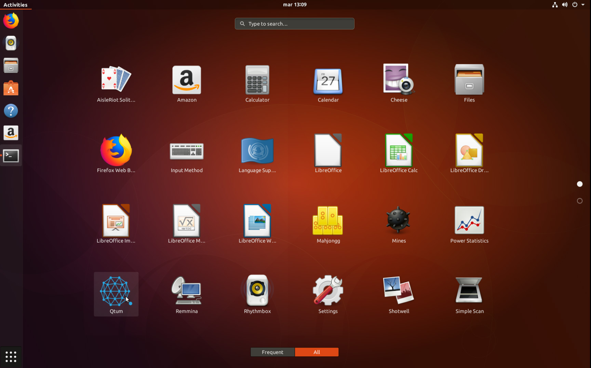

# Using EVO official Repository on Linux

We've published our official Evo repository on https://repo.coinevo.tech  this repository supports the following distributions:

### Debian

- 8.x (Jessie)
- 9.x (stretch)
- Testing (Buster)
- Unstable (Sid)

### Ubuntu

16.04 - 19.10

### Mint

18.x

## Other official repositories

### Centos/Fedora/Redhat

Tested on Centos 7, Fedora 30. Other releases should work fine as well.

https://rpmrepo.coinevo.tech

### Archlinux

[Get it from the AUR](https://aur.archlinux.org/packages/evo-core/) 

More distributions will be added in the future, this document will be updated to reflect those changes.

### Tutorial focus

This tutorial assumes you have a basic knowledge of Linux and terminal usage, the entire process uses the Linux terminal.

## Installing on Ubuntu

### Obtaining signing key

First, we need to obtain the Evo signing key from the ubuntu keyserver, here's how:

`sudo apt-key adv --keyserver keyserver.ubuntu.com --recv-keys  BF5B197D`

This will download and add the Evo signing key to your linux install.

### Adding repository to your APT sources.

`sudo su` - Sudo to root first

` echo "deb https://repo.coinevo.tech/apt/ubuntu/ bionic main" >> /etc/apt/sources.list.d/evo.list`

This will add the repository to your APT sources file. **NOTE:** Please remember to change "xenial" for your Ubuntu version codename *(for instance, Ubuntu 19.10 codename is eoan, in this case you need to replace bionic for eoan)*

### Refreshing APT sources and installing Evo

`sudo apt update && sudo apt install evo`

By doing this, we'll update our sources and install Evo on our ubuntu Box

## Installing on Debian

First, we need to make sure **sudo** is installed: 

Type `sudo su` and press enter, if you get a password prompt, then you can move on to obtaining the public key

### Installing sudo

Obtain admin privileges (su to root) and then type your admin user (root) password

Once you're logged in as "root" please type the following: `apt-get install sudo`

When sudo finishes installing, add your user to the sudo group: `gpasswd -a youruser sudo`
Logout and then log in again.

### Installing dirmngr and apt-transport-https

These two packages are needed to enable the Evo repository on Debian, let's install them:

`apt install -y apt-transport-https dirmngr`

### Obtaining Public key

`sudo apt-key adv --keyserver keyserver.ubuntu.com --recv-keys  BF5B197D`

This downloads and installs the Evo public key

### Adding repository to your APT sources.

`sudo su` - Sudo to root first

` echo "deb https://repo.coinevo.tech/apt/debian/ buster main" >> /etc/apt/sources.list.d/evo.list`

This will add the repository to your APT sources file. **NOTE:** Please remember to change "stretch" for your Debian version codename <!--(for instance, Debian 8.x codename is jessie, in this case you need to replace stretch for jessie)-->

### Refreshing APT sources and installing Evo

`sudo apt update && sudo apt install evo`

By doing this, we'll update our sources and install Evo on our debian Box

## Install on Centos/Redhat/Fedora

These are the steps you need to take to install Evo in a RPM-based distribution

1. Install the public key for the RPM repository:
   
   `sudo rpm --import https://rpmrepo.coinevo.tech/key.asc  `

2. Add the Evo repository:
   
   `sudo yum-config-manager --add-repo https://rpmrepo.coinevo.tech/`

3. `sudo yum update`

4. `sudo yum install evo`

You can also use dnf to install Evo on Fedora and distributions that support it.

## Install on Archlinux

To install on arch, the easiest way is to use "yay" https://aur.archlinux.org/packages/yay

`yay evo-core`

Compiling Evo should take a few mins, if you're familiar with yay, it's an AUR helper which really simplifies the process of installing packages from the Archlinux AUR. 

## Launching Evo

Launching is simple, we just go to our applications menu and scrolldown/search for evo 

This works, we can launch our Evo wallet and start syncing!
