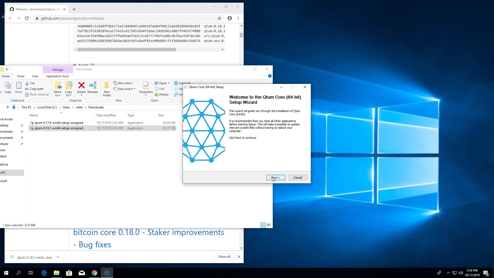
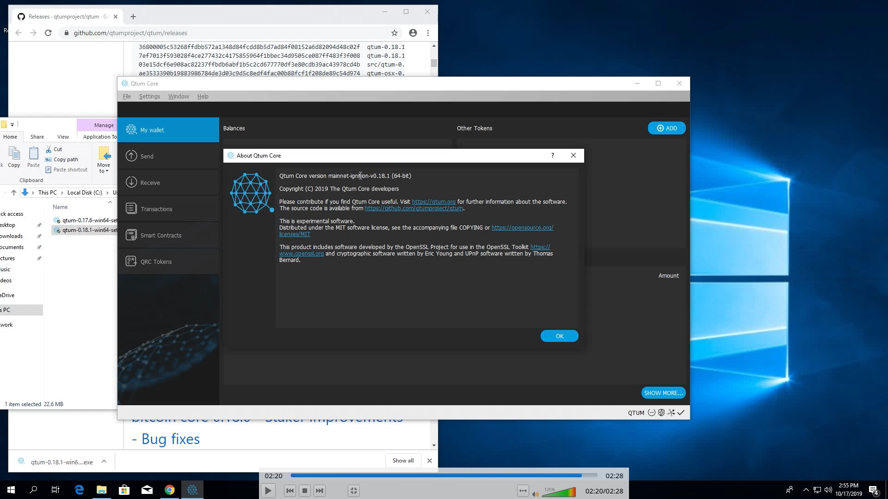
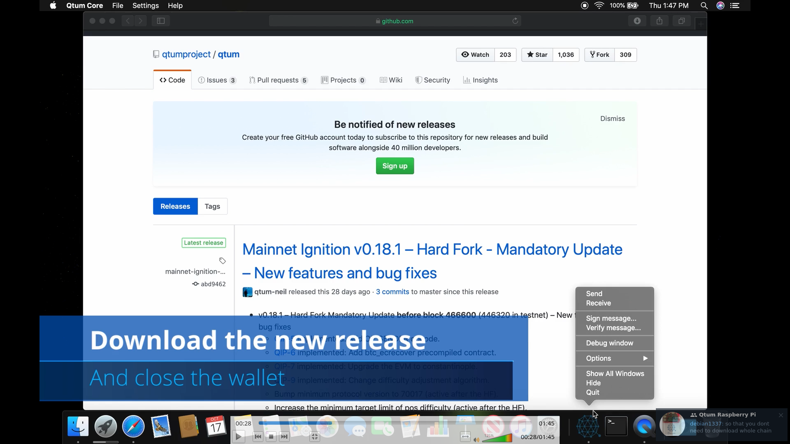
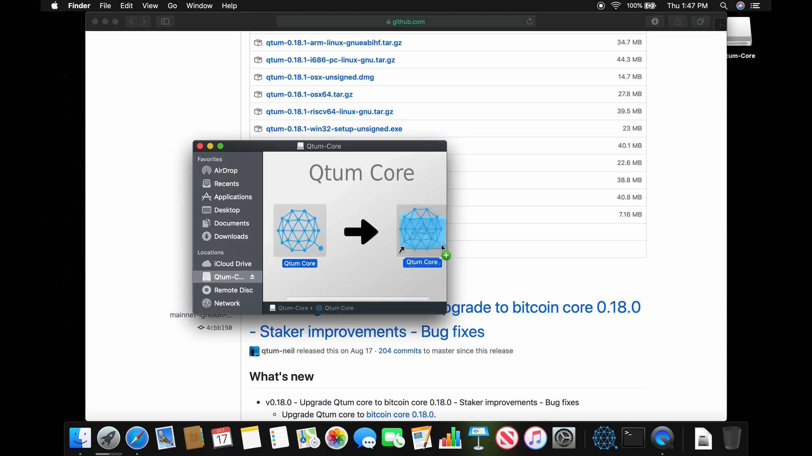
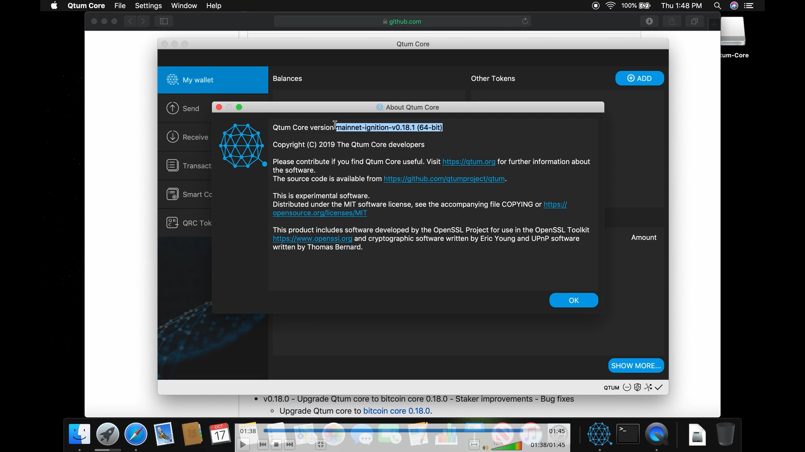
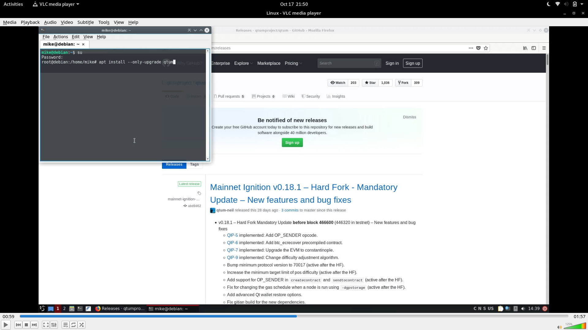
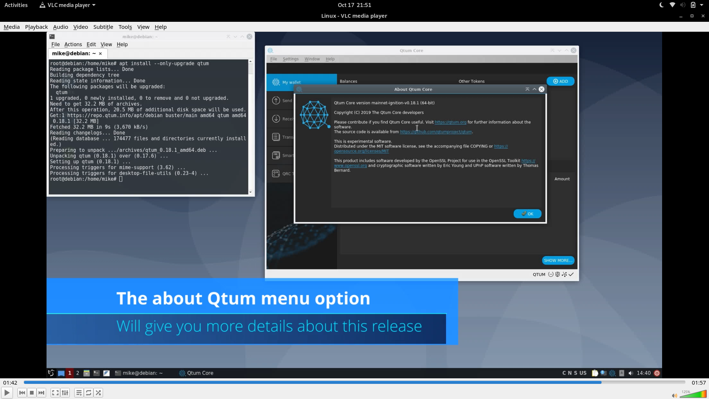

# How to update your Evo wallet

Updating your Evo wallet is quite easy, however, this process changes depending on which operating system you're running, in this document we'll go over the following OS:

- Windows

- Mac OS

- Linux

Keeping your Evo wallet up-to-date is one of the most important tasks that any staker, holder, developer and any type of Evo user must do. 

The process itself is quite simple, however it does vary depending on the operating system you're using.

## Update Evo on Windows

Here's a video on how to update your Evo wallet [https://www.youtube.com/watch?v=pNsdGXYUfUc](https://www.youtube.com/watch?v=pNsdGXYUfUc) - you can use this document as support for the video.

In this example, we're running a 0.17.6 Evo wallet version on Windows, it is outdated and won't be part of the hardfork, (we need to update ASAP).

However, if we're running the wallet (staking or just left it open), we need to do the following;

1. Close the wallet

2. Download latest Evo wallet version from either one of these links:
   https://github.com/coinevo/evo/releases
   https://evoeco.io/wallet
   
   ![1.png.png)

3. Install the latest wallet using the windows installer
   
   

4. Once the installer finishes, launch the wallet
   

5. Voila! you've updated Evo to the latest version available!

## Update Evo on Mac OS

Here's a video on how to update your Evo wallet https://www.youtube.com/watch?v=7SB4o5IgJPg - you can use this document as support for the video.

In this example, we're running a 0.17.6 Evo wallet version on Mac OS, it is outdated and won't be part of the hardfork, (we need to update ASAP).

- Close the wallet

- Download latest Evo wallet version from either one of these links: [https://github.com/coinevo/evo/releases](https://github.com/coinevo/evo/releases) [https://evoeco.io/wallet](https://evoeco.io/wallet)

- 
  
  Install the latest wallet using the Mac OS dmg 
  
  

- Once the upgrade finishes, launch the wallet

- 
  
  Voila! you've updated Evo to the latest version available!

## Update Evo on Linux

Here's a video on how to update your Evo wallet [https://www.youtube.com/watch?v=58CL-c6ZQKw](https://www.youtube.com/watch?v=58CL-c6ZQKw) - you can use this document as support for the video. 

In this example, we're running a 0.17.6 Evo wallet version on Linux, it is outdated and won't be part of the hardfork, (we need to update ASAP).

Now, if you just open the wallet, it'll show this screen where it says the wallet is outdated and that we should update to latest version.

- Close the wallet

- If you're using Evo Repo (recommended), all you have to do is either one of these:
  
  - Debian/Ubuntu/Mint `sudo apt update && sudo apt install --upgrade-only evo`
    
    

- Once the package manager finishes upgrading, launch the wallet
  
  

- Voila! you've updated Evo to the latest version available!
