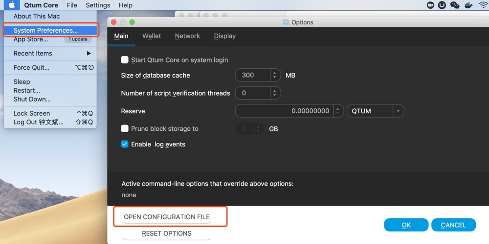

# Evo 如何添加运行选项（或配置文件）

Evo钱包程序除默认设置外，还可以通过添加运行选项或配置文件实现特定的功能或运行模式。

## PC 版钱包用户（Evo Core qt钱包）

大多数用户最常用的钱包是 Evo Core 钱包，即 Evo 官方的 PC 版钱包。（还未下载钱包？可从[https://evoeco.io/wallet](https://evoeco.io/wallet)下载最新版钱包）

PC 版钱包用户可以通过配置文件修改钱包配置(该方法对命令行钱包同样适用）。方法如下：

### 1. 创建`evo.conf`文件

在 Evo datadir 路径下创建名为`evo.conf`的文件，不同系统的默认的 datadir 路径稍有不同：

* Linux: ~/.evo
* OSX: ~/Library/Application Support/Evo
* Windows: %APPDATA%\Evo (把这个路径复制粘贴到浏览器地址栏，会自动解析出路径所在，之后再打开这个路径即可)

***请注意，除非你完全清楚自己在做什么，否则不要随意修改上述路径下的任何其他文件***

（注：datadir 路径也可以设置，但默认为上述路径。如果你设置了 datadir 路径，请在你设置的路径下进行后面的步骤）

如果你不会创建文件，也没有关系，用户还可以通过 PC 钱包直接打开和创建 `evo.conf`，在钱包菜单栏中点击 `System Preference`, 找到 `OPEN CONFIGURATION FILE`, 点击后即可自动弹出 `evo.conf` 文件，具体如下图所示：



### 2. 写入所需配置信息

在上述创建的新文件`evo.conf`中写入配置信息。

例如，如果需要配置rpc调用信息，可以在文件中写入：

```
rpcuser=test
rpcpassword=test1234
server=1
```

上述配置设置rpc调用的用户名为test，密码为test1234，并开启了server功能。

### 3. 重新启动钱包

重启钱包，配置文件即可生效。

### 其他选项

感兴趣的读者如果想了解其他所有可用的 Evo 配置信息及其含义，可以通过钱包查看：

打开钱包菜单栏的`Help->Command-line Options`，即可查看所有可用配置选项。


## 命令行钱包`evod`

不使用命令行模式的用户请忽略本小节内容。

对于熟悉命令行模式的用户或开发者，除上述添加配置文件的方式外，还可以直接通过命令行选项实现配置。

例如：

```
./evod -rpcuser=test -rpcpassword=test1234 -server=1
```

该例子中的选项`-rpcuser=test -rpcpassword=test1234 -server=1`实现了与上面提到的配置文件相同的配置。

需要注意的是，如果采用命令行选项运行 Evo 节点（`evod`），则在运行`evo-cli`时也需要添加相同的选项，例如对于上述的`evod`，对应的`evo-cli`命令为：

```
./evo-cli -rpcuser=test -rpcpassword=test1234 getinfo
```

### 命令行模式查看所有选项

用户可以通过一下命令查看所有可用选项：

```
./evod -help
```


